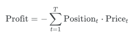

# Energy Trading Hackathon

This repository contains the environment where you will develop your trading strategy for the hackathon.

## Problem Overview

Your task is to build a 8-day trading algorithm that outputs charge/discharge actions for a virtual battery at 15-minute intervals.  
Your solution must respect all constraints listed below.

## Battery Constraints

### 1. Capacity
The battery has a total capacity of **10 MWh**.

### 2. Power
The battery has effectively infinite power.  
You may fully charge or discharge the battery in a single 15-minute interval.

### 3. Daily Reset
At **00:00 each day**, the battery state of charge (SoC) is reset to **5 MWh**, no matter what the SoC was at 23:45.

Examples:
- Ending the day at 2 MWh → next day starts at 5 MWh  
- Ending the day at 10 MWh → next day starts at 5 MWh  

The reset happens before applying the first action of the new day.

### 4. Extra constraints
If there is any more energy in the battery at the end of the day it will be sold at the lowest price interval in that day.

The minimum tranzaction is 0.1 MWh

## Output Requirements

Your algorithm must return an array of **768 actions**, representing 8 days of 15-minute intervals:

```
8 days x 24 hours/day x 4 intervals/hour = 768 actions
```

Each action is the power in MWh during that interval:
- Positive values → charging  
- Negative values → discharging  
- Zero → no action  

Example:

```python
output = pd.DataFrame(columns=["Time interval (CET/CEST)", "Position"])
```

You can also see an example submision in your repo. The timestamps have to stay the same, you only have to change the actions.


## Evaluation Metric

Your strategy will be evaluated using the following metric:



Where:
- `position[t]` is your charge/discharge decision at time t  
- `price[t]` is the market price at that same time  

Interpretation:
- Charging when prices are low (negative action * low price) improves your score  
- Discharging when prices are high (positive action * high price) improves your score  
- Poorly timed actions will decrease your score 
- You don't have acces to `price[t]`

Your goal is to maximize this total score across the 8-day horizon.

## Helper Function

This repository includes a file named:

```
helper_function.py
```

It contains a validation function you can use to check that your actions:
- Do not violate energy limits  
- Do not exceed capacity bounds  
- Respect the daily reset  
- Have the correct length  

Use this function before submitting your strategy.

If one of your actions violate one of the constraints that action will not be taken into account when computing the evaluation metric


## Questions

If you need help or clarification, feel free to ask any mentor.

## Notes

Have fun developing your solution and good luck.

## Please don't forget to push all your code to github

# This is the competition link: [Link to kaggle competition](https://www.kaggle.com/t/5af4059e849e433597c960c3050bd4fa)
